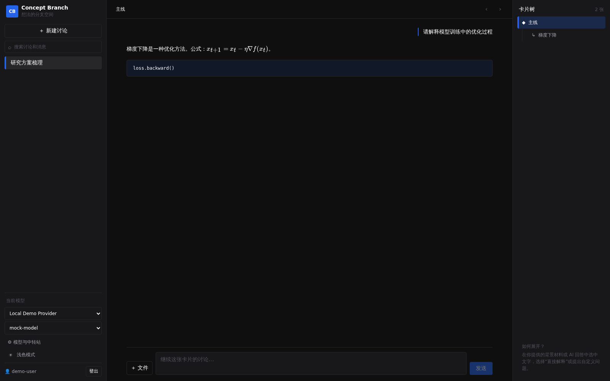

# Concept Branch

[English](README.md)

Concept Branch 是一个自托管的树状 AI 对话工作区。你可以从任意回答中选取一段文字，为这个问题建立独立子分支，同时保留原讨论和来源关系。



## 为什么做这个项目

长对话经常把主问题和有价值的支线混在一起。Concept Branch 让每个支线拥有自己的上下文，又能追溯它来自哪条消息、哪一个父节点，适合研究、技术阅读、设计探索和复杂问题拆解。

## 主要能力

- 从 Markdown 选区建立子分支，并保存来源消息与父节点。
- 在当前账号内检索讨论、分支和消息。
- 上传 PDF、TXT、Markdown、CSV、JSON 和 DOCX 作为背景材料。
- 子分支只读继承祖先分支的文件上下文，不重复存储。
- 支持 OpenAI-compatible Chat Completions 和 Responses 协议。
- 每个用户可维护多个 Provider 和模型。
- 按用户隔离讨论、附件、会话和 Provider 凭据。
- 渲染 Markdown、GFM 表格、代码块和 KaTeX 公式。
- 不使用真实 API key 即可运行后端、隔离、附件、构建和浏览器测试。

## 工程实现亮点

- **认证**：使用 scrypt 和独立盐值保存密码；数据库只保存 session token 的 SHA-256 哈希。
- **多租户隔离**：讨论、节点、附件和 Provider 查询都强制携带当前用户 ID；跨用户访问返回 `404`。
- **凭据边界**：Provider key 不进入 SQLite，以原子方式写入 `0700` 目录中的 `0600` 文件。
- **文件上限**：单文件 10 MB、单文件最多抽取 50,000 字符、单次模型请求最多注入 60,000 字符。
- **失败状态**：界面明确显示发送、等待和错误状态，失败输入会恢复以便重试。
- **可复现验收**：pytest、Vite production build 和 Playwright 使用隔离数据库、mock provider 与动态空闲端口。

组件和信任边界见[架构说明](docs/ARCHITECTURE.md)。

## 快速开始

环境要求：Python 3.11+、[uv](https://docs.astral.sh/uv/) 和 Node.js 22+。

```bash
uv sync
npm --prefix frontend ci
npm --prefix frontend run build
bash scripts/start_server.sh
```

打开 <http://127.0.0.1:8421>。第一个注册账号会标记为本机管理员，供后续角色功能使用；v0.1 暂无管理员专属权限。然后可在 Provider 设置中填写 OpenAI-compatible endpoint、模型名和 API key。

默认运行数据位于：

- `~/.local/share/concept-branch/concept-branch.sqlite3`
- `~/.config/concept-branch/`

可用 `CONCEPT_BRANCH_DB` 和 `CONCEPT_BRANCH_CONFIG_DIR` 改写路径。完整环境变量见 [.env.example](.env.example)。

## 开发与验证

```bash
uv sync
npm --prefix frontend ci
bash scripts/dev.sh
```

完整验收：

```bash
bash scripts/verify.sh
```

浏览器测试会自动选择空闲的 localhost 端口，因此可与另一个正在运行的 Concept Branch 实例并行。

## 部署边界

默认仅监听 `127.0.0.1`。可信局域网可设置 `CONCEPT_BRANCH_HOST=0.0.0.0`。任何公网部署都应放在 HTTPS 反向代理之后，同时设置 `CONCEPT_BRANCH_SECURE_COOKIES=1`、限制 CORS origin，并阅读 [SECURITY.md](SECURITY.md)。

当前版本是单节点应用，尚未提供密码找回、外部身份认证、分布式存储或开箱即用的公网部署包。

## 项目状态

`v0.1` 是持续维护中的公开预览版。核心对话、树状展开、认证、用户隔离、Provider、附件和浏览器工作流已有自动化测试。后续计划包括国际化、导入导出、备份恢复和加固后的反向代理部署方案。

## 参与项目

开发说明见 [CONTRIBUTING.md](CONTRIBUTING.md)。安全问题请按 [SECURITY.md](SECURITY.md) 私下报告，不要直接创建公开 issue。

## 许可证

[MIT](LICENSE)
