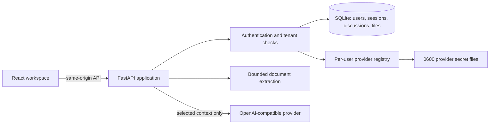

# Architecture

## System view

The production build is served by FastAPI, so browser and API traffic are same-origin. Vite's proxy is used only in development.

## Data ownership

| Data | Storage | Boundary |
|---|---|---|
| Users and password hashes | SQLite | scrypt hash plus per-user salt; database file `0600` in a `0700` directory |
| Sessions | SQLite and HttpOnly cookie | database stores SHA-256 token hashes only |
| Discussions and messages | SQLite | every query is scoped by authenticated user ID |
| Uploaded files | SQLite BLOB | owner ID and node lineage checked before access |
| Provider metadata | per-user JSON | API responses never include key material |
| Provider API keys | per-user secret files | atomic `0600` writes inside `0700` directories |

## Conversation model

A discussion owns a rooted tree of nodes. Each node has its own message sequence. Creating a child node records:

- the parent node;
- the source message;
- the selected text;
- an optional focused question;
- inherited attachment context resolved from its ancestors.

The backend validates that the selected text exists in the source message after a bounded Markdown-aware canonicalization step. It does not trust arbitrary browser selections.

## File-context pipeline

1. Reject unsupported formats and extracted file payloads larger than 10 MB; non-local deployments also need an ingress body limit at the reverse proxy.
2. Extract embedded text with a format-specific parser; DOCX rejects DTD/entity declarations and scanned PDFs are not OCR'd.
3. Bound stored extracted text to 50,000 characters per file.
4. Resolve current-node and ancestor attachments for each request.
5. Bound aggregate model context to 60,000 characters and expose truncation metadata.
6. Send only the resolved context for the active branch to the selected provider.

## Provider boundary

The application supports OpenAI-compatible Chat Completions and Responses transports. A configuration is tested with a minimal request before it replaces the active provider secret. Application logs record operation IDs, elapsed time, model identifiers, and sanitized error categories; they do not log prompt text, selected text, file content, URLs, or keys.

## Verification map

| Concern | Evidence |
|---|---|
| Authentication and cookie behavior | `tests/test_auth.py` |
| Cross-user data and key isolation | `tests/test_isolation.py` |
| File formats and extraction/context bounds | `tests/test_attachments.py` |
| Attachment inheritance and deletion | `tests/test_api.py` |
| API state transitions and selection validation | `tests/test_api.py` |
| Provider protocols and error handling | `tests/test_model.py`, `tests/test_config.py` |
| Full user workflow | `frontend/e2e/core.spec.js` |

`scripts/verify.sh` runs the backend suite, production frontend build, and full browser workflow against temporary storage and a local mock provider.
